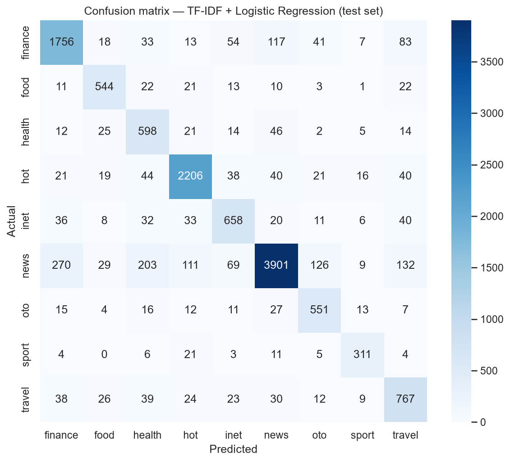
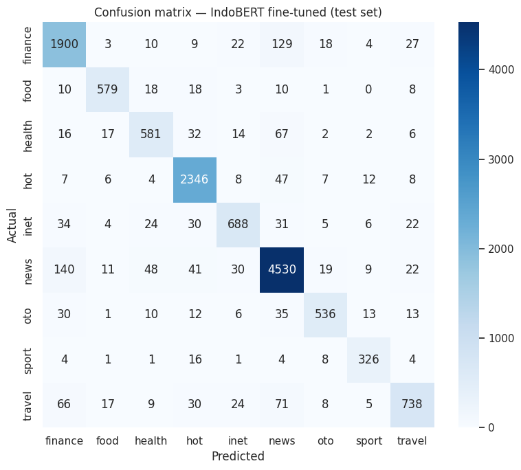
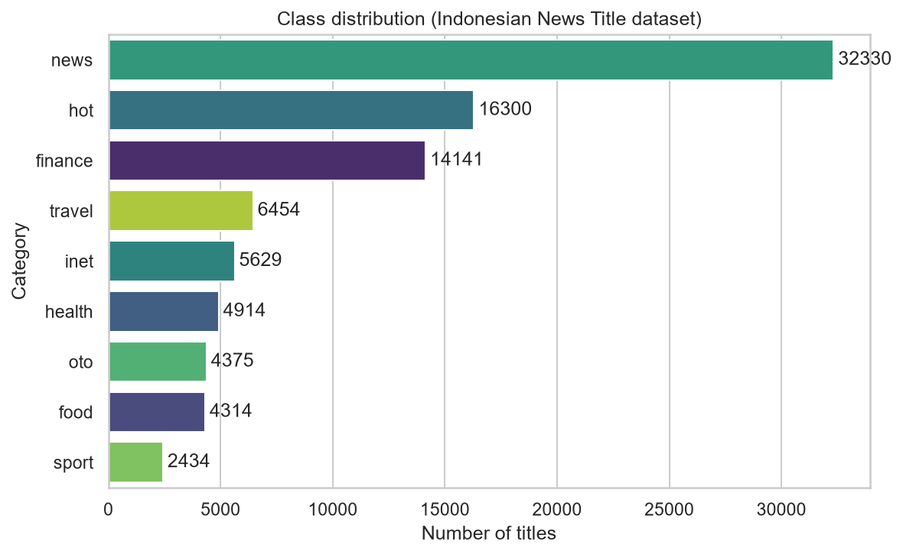
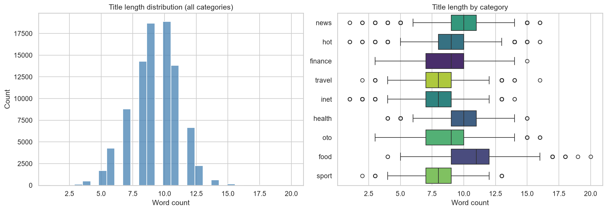
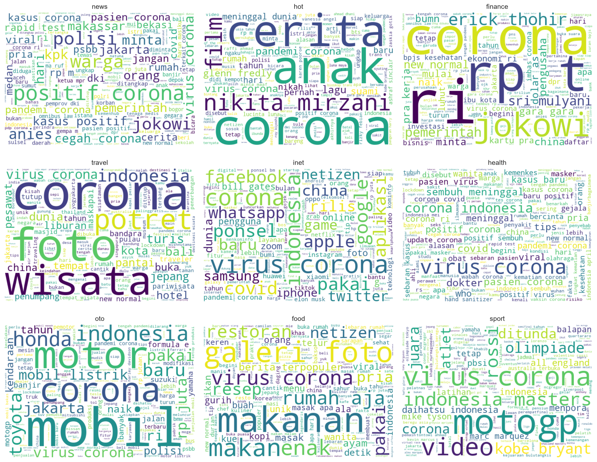

# IndoNewsClassifier

Indonesian-language news title classification, comparing a classical TF-IDF baseline against a fine-tuned IndoBERT transformer.

## Problem

Classify Indonesian-language news titles into one of 9 topic categories (finance, food, health, hot, inet, news, oto, sport, travel).

## Approach

1. **EDA** — class balance, title length distribution, word clouds per category, missing/duplicate check.
2. **Baseline**: TF-IDF (1-2 grams, 20k vocab) + Logistic Regression with balanced class weights.
3. **Transformer**: fine-tuned [`indobenchmark/indobert-base-p1`](https://huggingface.co/indobenchmark/indobert-base-p1), 3 epochs, learning rate 2e-5, early stopping on validation loss.
4. **Evaluation**: accuracy + macro-F1 + per-class precision/recall on a held-out test set for both models, plus a side-by-side comparison.

Full walkthrough is in [`notebooks/indonewsclassifier.ipynb`](notebooks/indonewsclassifier.ipynb).

## Dataset

[Indonesian News Title](https://www.kaggle.com/datasets/ibamibrahim/indonesian-news-title) (also mirrored on [GitHub](https://github.com/ibamibrahim/dataset-judul-berita-indonesia)) — 91,017 titles scraped from detik.com (Jan–Jun 2020), single-label category per title. Not committed to this repo (see [Reproduction](#reproduction)); link to source instead.

## Results

Test set, 13,634 titles (15% stratified split), 9 classes:

| Model | Accuracy | Macro F1 | Trainable params | Training hardware |
|---|---|---|---|---|
| TF-IDF + Logistic Regression | 82.79% | 0.8000 | 180,009 | Laptop CPU, seconds |
| **IndoBERT (fine-tuned)** | **89.66%** | **0.8705** | 124,448,265 | Colab T4 GPU, ~15 min (3 epochs) |

IndoBERT improved macro-F1 by +0.0705 (+8.8% relative) with **no class regressions** — every one of the 9 categories improved, with the largest gains on the baseline's weakest classes (`health`: 0.692→0.806 F1, `travel`: 0.738→0.813 F1). Full per-class breakdown and discussion of the accuracy/cost trade-off are in the notebook's comparison section.

### Confusion matrices

| TF-IDF + Logistic Regression | IndoBERT (fine-tuned) |
|---|---|
|  |  |

### EDA

| Class distribution | Title length | Word clouds |
|---|---|---|
|  |  |  |

## Demo

**Live**: [indonewsclassifier.streamlit.app](https://indonewsclassifier.streamlit.app/) — paste an Indonesian news title, get a predicted category and a confidence chart. Serves the TF-IDF + Logistic Regression baseline (deployed on Streamlit Community Cloud, not HuggingFace Spaces — Spaces now requires a paid PRO plan for Docker/Streamlit hosting on CPU, which would've broken this project's no-paid-compute constraint).

## Repo structure

```
IndoNewsClassifier/
├── notebooks/     EDA → preprocessing → baseline → transformer → evaluation
├── src/           reusable modules (preprocessing, training, inference)
├── models/        committed baseline checkpoint (IndoBERT weights aren't committed — see notebook Section 5 to reproduce and optionally push to HF Hub)
├── docs/          confusion matrices, charts for this README
├── app.py         Streamlit inference app
└── requirements.txt
```

## Reproduction

```bash
git clone https://github.com/aljuhaeda/IndoNewsClassifier.git
cd IndoNewsClassifier
python -m venv .venv && .venv/Scripts/activate  # or source .venv/bin/activate on macOS/Linux
pip install -r requirements.txt
```

Open `notebooks/indonewsclassifier.ipynb`. Sections 1–4 (EDA, preprocessing, baseline) run on CPU locally — the notebook downloads the raw dataset automatically. Section 5 (IndoBERT fine-tune) needs a GPU; open the notebook in Colab (`File → Open notebook → GitHub → aljuhaeda/IndoNewsClassifier`), set the runtime to a T4 GPU, and run all cells — Section 1's bootstrap cell clones the repo and fetches the data automatically.

## Limitations

- **Titles only, not full article text.** Shorter input than a full-article classifier would get; a trade-off for having a clean, single-label, already-classification-ready dataset within the project's time budget.
- **Single time window (Jan–Jun 2020), single source (detik.com).** The window overlaps COVID-19 onset in Indonesia, so "corona"/"virus"/"pandemi" dominate vocabulary across nearly every category — the model's learned vocabulary is skewed toward one global event rather than being representative of Indonesian news in general. A model trained on this data may not generalize as well to other periods or outlets.
- **Class imbalance**: `news` (32,330 titles) vs. `sport` (2,434), a 13.3x ratio. Macro-F1 is reported alongside accuracy specifically because of this.
- **`news` is a catch-all category** that overlaps semantically with the other 8 — it's the largest source of confusion for both models (see confusion matrices above).

## Status

- [x] EDA
- [x] TF-IDF + Logistic Regression baseline
- [x] IndoBERT fine-tune
- [x] Model comparison
- [x] Streamlit app
- [x] Deployed (Streamlit Community Cloud)

## License

MIT — see [LICENSE](LICENSE). Dataset license per its [source](https://github.com/ibamibrahim/dataset-judul-berita-indonesia).
